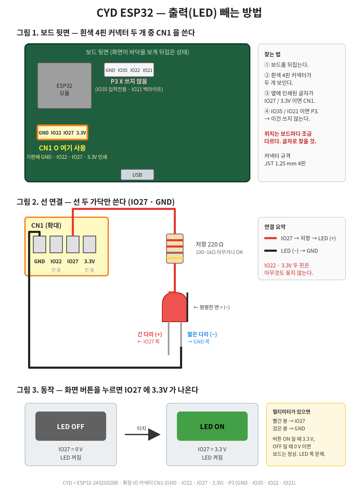

# CYD ESP32 보일러 컨트롤러

CYD(ESP32-2432S028R, 2.8" 터치 LCD) 보드로 만든 릴레이 제어기.
화면을 터치해 릴레이를 켜고, 세 가지 동작 모드를 고를 수 있다.



## 화면

### 메인

| 위치 | 내용 |
|---|---|
| 왼쪽 위 | sleep time (초). 칸 위쪽 터치 +, 아래쪽 터치 − |
| 오른쪽 위 | running time (초). 칸 위쪽 터치 +, 아래쪽 터치 − |
| 왼쪽 아래 | 조도센서 값 (0~4095) |
| 오른쪽 아래 | Manual 모드에서 누르는 동안 릴레이 On + 누른 시간(0.1초 단위) 표시. 떼면 5초간 유지. 다른 모드에서는 `Disable` |
| 오른쪽 위 구석 | 기어 아이콘 → 설정 화면 |
| 오른쪽 아래 구석 | 릴레이 동작 표시등 (On이면 초록) |

Time 모드에서는 남은 시간이 작게 표시된다. 쉬는 중이면 sleep time 칸 오른쪽 아래,
작동 중이면 running time 칸 왼쪽 아래.

### 설정

기어 아이콘을 누르면 들어간다. 같은 자리의 화살표를 누르면 메인으로 돌아간다.

| 모드 | 동작 |
|---|---|
| Time mode | sleep time 동안 쉬고 → running time 동안 작동. 반복 |
| Sensor mode | 조도값이 기준값 이상이면 자동 On, 미만이면 자동 Off |
| Manual mode | 누르는 동안만 On (기본값) |

Light level: − / + 로 100씩 조절 (0~4095, 기본 2000)

## 배선

| 장치 | 핀 | 커넥터 |
|---|---|---|
| 릴레이 IN | IO27 | CN1 (GND · IO22 · IO27 · 3.3V) |
| 조도센서 AO | IO35 | P3 (GND · IO35 · IO22 · IO21) |
| GND / 3.3V | — | 양쪽 커넥터 모두 있음 |

자세한 그림과 문제 해결은 [docs/led_wiring.md](docs/led_wiring.md) 참고.

## 빌드

PlatformIO를 쓴다.

```bash
conda activate cyd
pio run -t upload
pio device monitor
```

디스플레이는 HSPI, 터치(XPT2046)는 VSPI를 쓴다. 두 장치가 같은 SPI 버스를 쓰면
터치가 동작하지 않으므로 `USE_HSPI_PORT` 설정이 꼭 필요하다.

## 구성

| 파일 | 내용 |
|---|---|
| `src/main.cpp` | 전체 펌웨어 |
| `platformio.ini` | 보드 · 라이브러리 · TFT_eSPI 핀 설정 |
| `docs/` | 배선 그림과 설명 |
