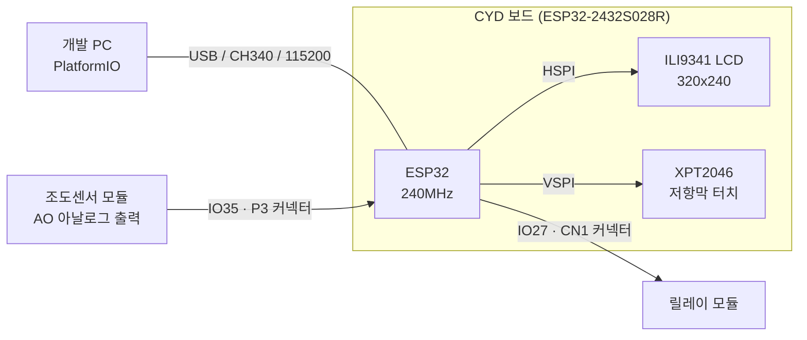
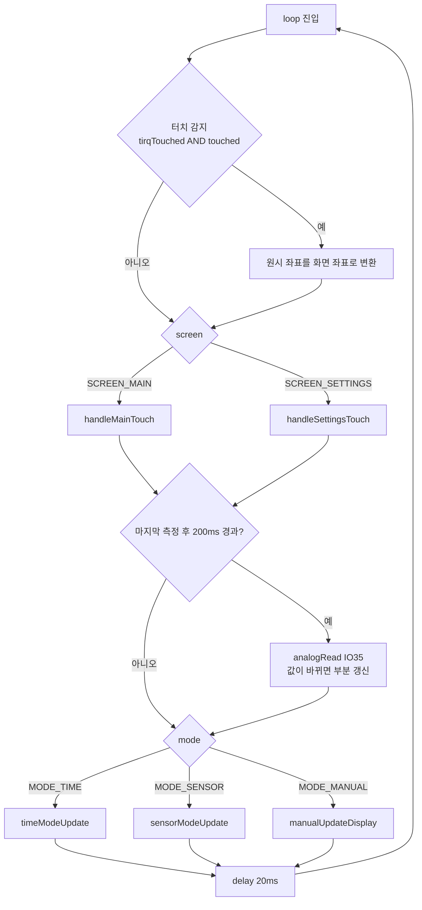
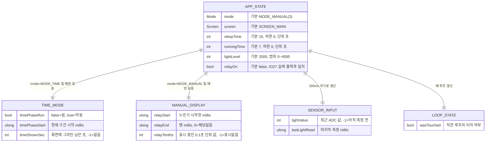
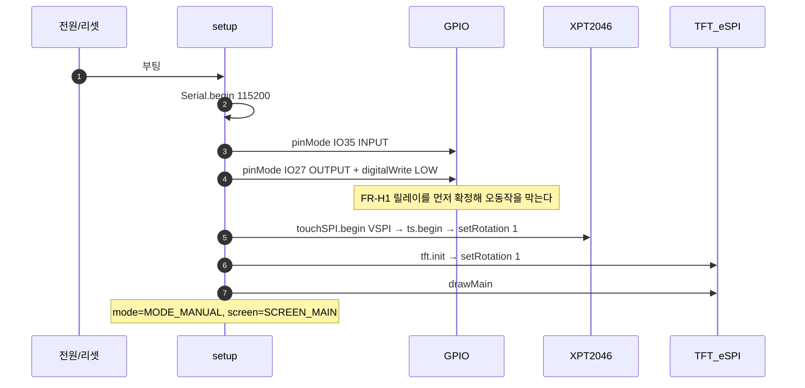
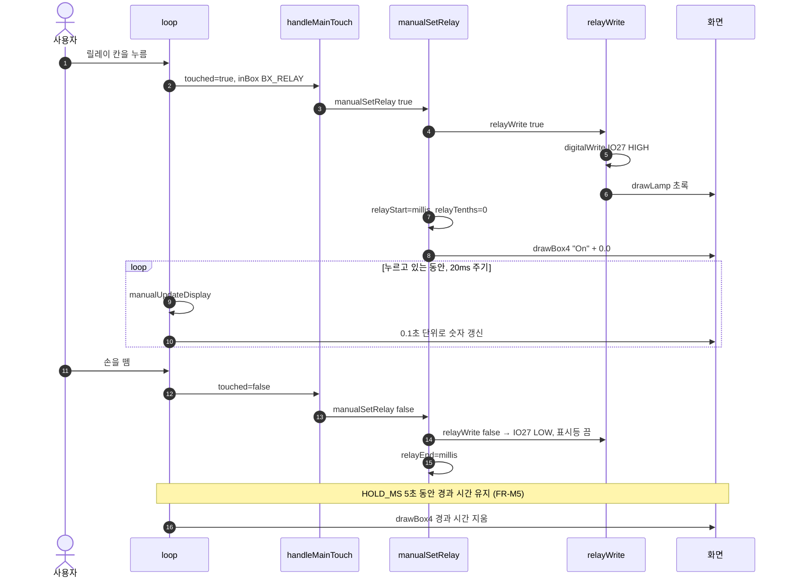
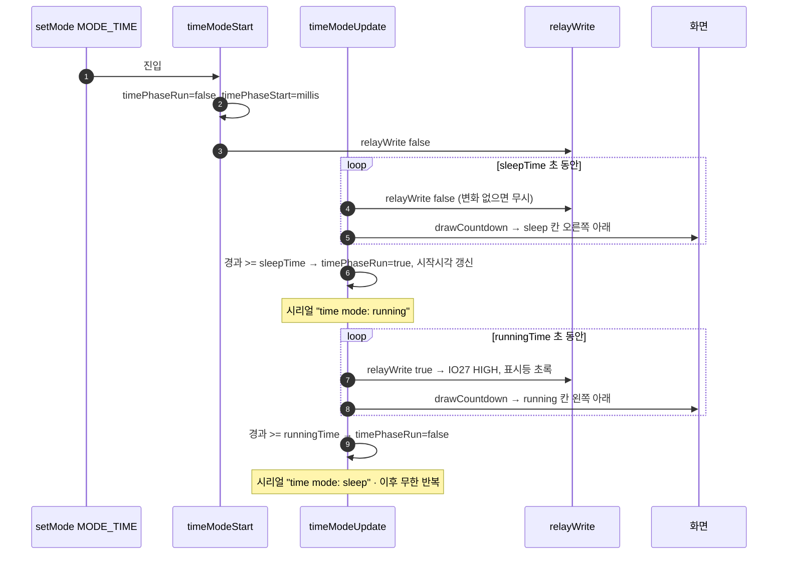
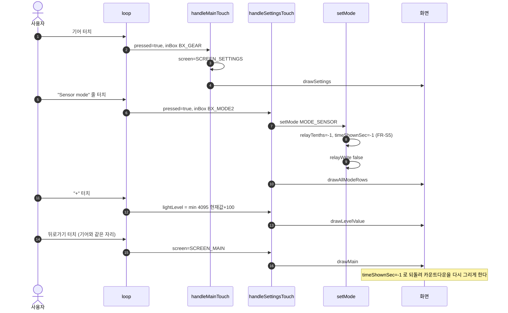
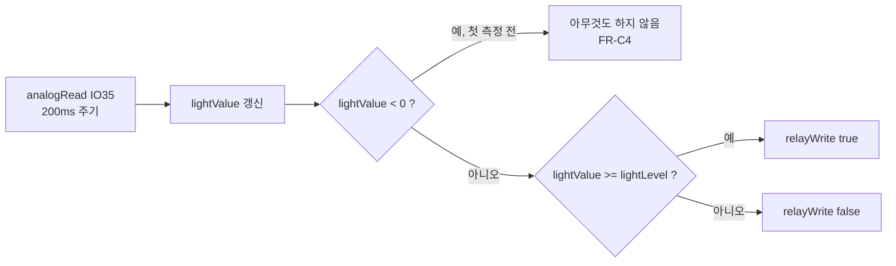

# PROJECT_SPEC — CYD ESP32 보일러 컨트롤러

> 작성일 2026-09-27 · 기준 커밋 `fa2e832` · 파생 문서의 단일 설계 기준(SSOT)

---

## 1. 개요

### 1.1 정체성

CYD(ESP32-2432S028R) 보드 한 장으로 동작하는 **단독 릴레이 컨트롤러**. 네트워크·서버·외부 앱이 없다.
2.8인치 저항막 터치 LCD가 유일한 입력이며, 조도센서 한 개를 읽고 릴레이 한 개를 제어한다.

동작 모드는 세 가지이고 한 번에 하나만 활성화된다. 자세한 내용은 §3, §7 참고.

| 모드 | 요약 |
|---|---|
| Time | `sleepTime` 초 쉬고 → `runningTime` 초 작동, 무한 반복 |
| Sensor | 조도값이 기준값 이상이면 On, 미만이면 Off |
| Manual | 화면을 누르는 동안만 On (기본값) |

### 1.2 기술 스택

| 항목 | 값 | 근거 |
|---|---|---|
| 보드 | ESP32-2432S028R (통칭 CYD) | [platformio.ini](../platformio.ini) `board = esp32dev` |
| MCU | ESP32 240MHz · RAM 320KB · Flash 4MB | 빌드 로그 |
| 프레임워크 | Arduino (ESP32 core 2.0.17) | `framework = arduino`, 패키지 `3.20017` |
| 플랫폼 | PlatformIO Espressif32 6.9.0 | 빌드 로그 |
| 디스플레이 | ILI9341 320x240 · TFT_eSPI 2.5.43 | `ILI9341_2_DRIVER=1` |
| 터치 | XPT2046 · XPT2046_Touchscreen (GitHub master) | `lib_deps` |
| 언어 | C++ (단일 파일) | [src/main.cpp](../src/main.cpp) |
| 빌드 환경 | conda 환경 `cyd` + PlatformIO Core 6.2.0 | §9 |

현재 펌웨어 크기: **RAM 22,644 B (6.9%) · Flash 339,137 B (25.9%)**

### 1.3 하드웨어 토폴로지



두 SPI 버스를 나눠 쓰는 것이 이 보드의 핵심 제약이다. §8.1 참고.

---

## 2. 하드웨어 구성 & 핀 맵

이 프로젝트에는 사용자 계정·역할·권한 개념이 없다. 보드 앞에 선 사람이 유일한 조작자다.
대신 그 자리를 **핀 배치**가 차지한다. 코드가 의존하는 물리 인터페이스는 아래가 전부다.

### 2.1 확장 IO (외부 배선 필요)

| 기능 | 핀 | 방향 | 커넥터 | 코드 상수 |
|---|---|---|---|---|
| 릴레이 출력 | IO27 | 디지털 출력 | CN1 (`GND · IO22 · IO27 · 3.3V`) | `RELAY_PIN` |
| 조도센서 입력 | IO35 | 아날로그 입력 (ADC1_CH7) | P3 (`GND · IO35 · IO22 · IO21`) | `LIGHT_PIN` |

배선 그림과 문제 해결은 [docs/led_wiring.md](led_wiring.md) 참고.

### 2.2 보드 내장 (배선 불필요)

| 장치 | 버스 | 핀 |
|---|---|---|
| ILI9341 LCD | HSPI | CS 15 · DC 2 · SCLK 14 · MOSI 13 · MISO 12 · RST -1 · BL 21 |
| XPT2046 터치 | VSPI | CS 33 · CLK 25 · MOSI 32 · MISO 39 · IRQ 36 |

LCD 핀은 라이브러리 설정 파일이 아니라 [platformio.ini](../platformio.ini)의 `build_flags`로 주입한다(`USER_SETUP_LOADED=1`).
터치 핀은 [src/main.cpp](../src/main.cpp) 상단 `#define`으로 정의한다.

### 2.3 쓰면 안 되는 핀

| 핀 | 이유 |
|---|---|
| IO21 | LCD 백라이트 전용 |
| IO35 | 입력 전용. 출력으로 쓸 수 없음 (현재 조도센서가 점유) |
| IO22 | 두 커넥터에 모두 나와 있으나 ADC 불가. 디지털 용도로만 여유 있음 |

---

## 3. 기능 요구사항

파생 문서가 역추적할 수 있도록 안정적 ID를 부여한다. **번호는 재사용·재부여하지 않는다.**

### 3.1 메인 화면 (FR-M)

| ID | 요구사항 | 구현 |
|---|---|---|
| FR-M1 | 왼쪽 위 칸은 `sleepTime`(초)을 표시한다. 칸 위쪽 절반을 누르면 +1, 아래쪽 절반을 누르면 −1. 하한 0 | `handleMainTouch()` |
| FR-M2 | 오른쪽 위 칸은 `runningTime`(초)을 같은 방식으로 조절한다. 하한 0 | `handleMainTouch()` |
| FR-M3 | 왼쪽 아래 칸은 조도센서 값(0~4095)을 표시한다. 200ms 주기로 읽고 값이 바뀐 경우에만 다시 그린다 | `loop()` |
| FR-M4 | 오른쪽 아래 칸은 Manual 모드에서 누르는 동안 릴레이를 On 하고, 누른 시간을 0.1초 단위로 표시한다 | `manualSetRelay()` · `manualUpdateDisplay()` |
| FR-M5 | 손을 떼면 경과 시간이 5초(`HOLD_MS`) 동안 화면에 남았다가 사라진다 | `manualUpdateDisplay()` |
| FR-M6 | Time·Sensor 모드에서는 오른쪽 아래 칸에 `Disable`을 표시하고 터치를 받지 않는다 | `drawBox4()` · `handleMainTouch()` |
| FR-M7 | 화면 오른쪽 아래 구석에 릴레이 동작 표시등을 둔다. On이면 초록으로 채우고 Off면 비운다. 모드와 무관하게 동작한다 | `drawLamp()` |
| FR-M8 | Time 모드에서 남은 시간을 1초 단위(올림)로 작게 표시한다. 쉬는 구간이면 sleep 칸 오른쪽 아래, 작동 구간이면 running 칸 왼쪽 아래 | `drawCountdown()` |
| FR-M9 | 오른쪽 위 기어 아이콘을 누르면 설정 화면으로 전환한다 | `handleMainTouch()` |

### 3.2 설정 화면 (FR-S)

| ID | 요구사항 | 구현 |
|---|---|---|
| FR-S1 | 세 모드를 라디오 버튼으로 표시하고 그중 하나만 선택할 수 있다 | `drawModeRow()` · `handleSettingsTouch()` |
| FR-S2 | 기본 선택은 Manual mode | `Mode mode = MODE_MANUAL` |
| FR-S3 | Sensor 모드 기준값(`lightLevel`)을 − / + 버튼으로 100씩 조절한다. 범위 0~4095, 기본 2000 | `handleSettingsTouch()` |
| FR-S4 | 뒤로가기 아이콘은 메인 화면의 기어와 **같은 자리**(오른쪽 위)에 둔다. 누르면 메인으로 돌아간다 | `BX_BACK` = `BX_GEAR` |
| FR-S5 | 모드를 바꾸면 릴레이를 즉시 Off 하고 경과 시간·카운트다운 표시를 초기화한다. Time 모드를 고르면 쉬는 구간부터 시작한다 | `setMode()` |

### 3.3 릴레이 제어 (FR-C)

| ID | 요구사항 | 구현 |
|---|---|---|
| FR-C1 | Time 모드는 `sleepTime` 초 Off → `runningTime` 초 On 을 무한 반복한다 | `timeModeUpdate()` |
| FR-C2 | Time 모드에서 두 시간이 모두 0이면 릴레이를 Off로 유지한다 | `timeModeUpdate()` |
| FR-C3 | Sensor 모드는 조도값이 기준값 **이상**이면 On, 미만이면 Off 한다 | `sensorModeUpdate()` |
| FR-C4 | Sensor 모드에서 첫 측정이 끝나기 전(`lightValue < 0`)에는 릴레이를 건드리지 않는다 | `sensorModeUpdate()` |
| FR-C5 | Manual 모드는 릴레이 칸을 누르고 있는 동안에만 On 한다 | `handleMainTouch()` |

### 3.4 하드웨어 I/O (FR-H)

| ID | 요구사항 | 구현 |
|---|---|---|
| FR-H1 | 부팅 직후 릴레이 출력을 LOW로 확정한다 | `setup()` |
| FR-H2 | 조도센서는 IO35에서 아날로그로 읽는다 | `analogRead(LIGHT_PIN)` |
| FR-H3 | 상태 변화를 115200 baud 시리얼로 기록한다 | §6.2 |

---

## 4. 아키텍처·컴포넌트

### 4.1 소스 구조

단일 번역 단위다. 파일 분리는 하지 않았다.

```
src/main.cpp
├─ 핀 정의 · 색 상수 · enum (Mode, Screen)
├─ 전역 상태 변수                    → §5
├─ 레이아웃 상수 (struct Box)        → §4.2
├─ 그리기 함수
│  ├─ 공용   : drawFrame, drawNumber, inBox
│  ├─ 메인   : drawGear, drawLamp, drawCountdown,
│  │           drawPlusMinus, drawBox1~4, drawMain
│  └─ 설정   : drawModeRow, drawAllModeRows,
│              drawLevelValue, drawSettings
├─ 릴레이 제어
│  ├─ relayWrite            (단일 출력 지점)
│  ├─ manualSetRelay / manualUpdateDisplay
│  ├─ timeModeStart / timeModeUpdate
│  ├─ sensorModeUpdate
│  └─ setMode
└─ setup / loop
   ├─ handleMainTouch
   └─ handleSettingsTouch
```

**릴레이 출력은 `relayWrite()` 한 곳에서만 일어난다.** 모든 모드가 이 함수를 통과하므로
표시등 갱신과 시리얼 로그가 자동으로 따라붙는다.

### 4.2 화면 레이아웃

좌표계는 `setRotation(1)` 기준 가로 **320 × 240**.

#### 메인 화면

| 요소 | 상수 | x, y, w, h | 터치 동작 |
|---|---|---|---|
| sleep time 칸 | `BX_SLEEP` | 6, 26, 135, 88 | 위 절반 +1 / 아래 절반 −1 |
| running time 칸 | `BX_RUN` | 147, 26, 135, 88 | 위 절반 +1 / 아래 절반 −1 |
| 조도값 칸 | `BX_LIGHT` | 6, 124, 135, 88 | 없음 (표시 전용) |
| 릴레이 칸 | `BX_RELAY` | 147, 124, 135, 88 | Manual 모드에서 누르는 동안 On |
| 기어 아이콘 | `BX_GEAR` | 284, 0, 36, 44 | 설정 화면 진입 |
| 동작 표시등 | `LAMP_X/Y/R` | 중심 (302, 200), 반지름 12 | 없음 (표시 전용) |

#### 설정 화면

| 요소 | 상수 | x, y, w, h | 터치 동작 |
|---|---|---|---|
| Time mode 줄 | `BX_MODE1` | 10, 44, 250, 32 | `setMode(MODE_TIME)` |
| Sensor mode 줄 | `BX_MODE2` | 10, 80, 250, 32 | `setMode(MODE_SENSOR)` |
| Manual mode 줄 | `BX_MODE3` | 10, 116, 250, 32 | `setMode(MODE_MANUAL)` |
| 기준값 − | `BX_LV_M` | 150, 156, 44, 36 | `lightLevel −100` (하한 0) |
| 기준값 + | `BX_LV_P` | 266, 156, 44, 36 | `lightLevel +100` (상한 4095) |
| 뒤로가기 | `BX_BACK` | 284, 0, 36, 44 | 메인 화면 복귀 |

`BX_BACK`과 `BX_GEAR`는 **같은 사각형**이다. 화면 상태(`screen`)로 분기하므로 충돌하지 않는다.

### 4.3 메인 루프



루프 주기는 약 20ms다. 이 값이 터치 반응 속도와 경과 시간 표시(0.1초)의 해상도를 함께 결정한다.

---

## 5. 상태 모델

영속 저장소·데이터베이스가 없다. 모든 상태는 **RAM의 전역 변수**이며 전원을 끄면 사라진다(§8.6).
아래는 그 상태를 논리적 묶음으로 본 것이다.



### 5.1 상수

| 상수 | 값 | 의미 |
|---|---|---|
| `HOLD_MS` | 5000 | 손을 뗀 뒤 경과 시간을 화면에 유지하는 시간 (FR-M5) |
| 루프 지연 | 20 ms | `delay(20)` |
| 조도 측정 주기 | 200 ms | `lastLightRead` 비교값 |

### 5.2 상태 불변식

- `relayOn`은 항상 IO27의 실제 출력과 같다. `relayWrite()`가 유일한 변경 지점이기 때문이다.
- `relayTenths >= 0` 이면 릴레이 칸에 경과 시간이 표시 중이다. Manual 모드에서만 0 이상이 된다.
- 모드를 바꾸면 `relayOn=false`, `relayTenths=-1`, `timeShownSec=-1`이 보장된다 (`setMode()`).

---

## 6. 인터페이스 목록

외부 API가 없다. 이 장치의 인터페이스는 **터치 입력**과 **시리얼 출력** 두 가지다.

### 6.1 터치 입력

`pressed`(누르는 순간 1회)와 `touched`(누르고 있는 동안 계속) 두 가지를 구분해 쓴다.

| 화면 | 영역 | 트리거 | 동작 | 요구사항 |
|---|---|---|---|---|
| 메인 | `BX_GEAR` | pressed | 설정 화면 진입 | FR-M9 |
| 메인 | `BX_SLEEP` 위 절반 | pressed | `sleepTime += 1` | FR-M1 |
| 메인 | `BX_SLEEP` 아래 절반 | pressed | `sleepTime -= 1` (하한 0) | FR-M1 |
| 메인 | `BX_RUN` 위 절반 | pressed | `runningTime += 1` | FR-M2 |
| 메인 | `BX_RUN` 아래 절반 | pressed | `runningTime -= 1` (하한 0) | FR-M2 |
| 메인 | `BX_RELAY` | **touched** | Manual 모드에서 누르는 동안 릴레이 On | FR-M4 · FR-C5 |
| 설정 | `BX_BACK` | pressed | 메인 화면 복귀 | FR-S4 |
| 설정 | `BX_MODE1/2/3` | pressed | 모드 선택 | FR-S1 |
| 설정 | `BX_LV_M` / `BX_LV_P` | pressed | 기준값 ∓100 | FR-S3 |

`BX_RELAY`만 레벨 방식(`touched`)이다. 나머지는 모두 엣지 방식이라 길게 눌러도 한 번만 반응한다.

### 6.2 시리얼 출력 (115200 baud)

상태가 바뀔 때만 한 줄씩 나온다. 자동 테스트와 현장 점검의 유일한 관찰 창구다.

| 출력 형식 | 발생 지점 | 의미 |
|---|---|---|
| `relay ON` / `relay OFF` | `relayWrite()` | 릴레이 출력 변화. 모든 모드 공통 |
| `sleepTime=<n>` | `handleMainTouch()` | 쉬는 시간 변경 |
| `runningTime=<n>` | `handleMainTouch()` | 작동 시간 변경 |
| `mode=<1\|2\|3>` | `setMode()` | 1 Time · 2 Sensor · 3 Manual |
| `lightLevel=<n>` | `handleSettingsTouch()` | Sensor 기준값 변경 |
| `time mode: sleep` / `time mode: running` | `timeModeUpdate()` | Time 모드 구간 전환 |

조도값 자체는 로그로 내보내지 않는다. 화면에만 표시한다.

---

## 7. 데이터 흐름

### 7.1 부팅



### 7.2 Manual 모드 릴레이 조작



### 7.3 Time 모드 한 주기



### 7.4 설정 화면 진입과 복귀



### 7.5 Sensor 모드 판정



---

## 8. 횡단 관심사

### 8.1 SPI 버스 분리 (필수)

LCD와 터치 컨트롤러가 **같은 SPI 버스를 쓰면 터치가 전혀 동작하지 않는다.**
개발 중 실제로 겪은 문제이며, 증상은 화면은 정상인데 터치 이벤트가 하나도 들어오지 않는 것이다.

해결책은 두 가지를 동시에 적용하는 것이다.

| 대상 | 버스 | 설정 위치 |
|---|---|---|
| LCD | HSPI | `platformio.ini`의 `-D USE_HSPI_PORT=1` |
| 터치 | VSPI | `SPIClass touchSPI(VSPI)` + `ts.begin(touchSPI)` |

`USE_HSPI_PORT`를 지우면 즉시 재발한다.

### 8.2 터치 좌표 보정

XPT2046 원시값을 화면 좌표로 선형 변환한다.

```cpp
x = map(p.x, 200, 3700, 0, 320);
y = map(p.y, 240, 3800, 0, 240);
```

보드 개체차로 터치 위치가 어긋나면 **이 네 개의 경계값만** 고치면 된다. 다른 곳은 건드릴 필요 없다.

### 8.3 화면 갱신 최소화

전체 `fillScreen()`은 화면 전환(`drawMain`, `drawSettings`) 때만 호출한다.
값이 바뀐 칸만 부분적으로 다시 그려 깜빡임을 줄인다.

숫자가 작아질 때 이전 글자가 남는 문제는 `setTextPadding()`으로 배경을 함께 지워 해결한다.
카운트다운은 `drawCountdown()`이 두 칸의 영역을 모두 지운 뒤 현재 구간 쪽만 그린다.

### 8.4 터치 엣지 검출

```cpp
bool pressed = touched && !wasTouched;
```

`wasTouched`를 루프 끝에서 갱신해 "누르는 순간"을 한 번만 잡는다.
증감 버튼과 모드 선택은 이 방식이라 길게 눌러도 한 칸만 움직인다.
릴레이 칸만 예외로 `touched`(레벨)을 써서 누르고 있는 동안 계속 On을 유지한다.

### 8.5 릴레이 안전

- 부팅 직후 `digitalWrite(RELAY_PIN, LOW)`로 출력을 확정한다 (FR-H1).
- 모드를 바꾸면 무조건 Off부터 한다 (FR-S5).
- 출력 지점이 `relayWrite()` 하나뿐이라 상태와 실제 출력이 어긋날 수 없다.

### 8.6 상태 비영속

전원을 껐다 켜면 `mode`, `sleepTime`, `runningTime`, `lightLevel`이 모두 기본값으로 돌아간다.
NVS(Preferences) 저장은 적용하지 않았다. §8.7 참고.

### 8.7 미구현·알려진 한계

| 항목 | 현재 상태 | 영향 |
|---|---|---|
| 설정 영속 저장 | 미구현 | 재부팅 시 기본값 복귀 (§8.6) |
| Sensor 모드 히스테리시스 | 없음 | 조도가 기준값 근처에서 흔들리면 릴레이가 자주 바뀔 수 있음 |
| 조도센서 미연결 시 동작 | 값이 계속 흔들림 | 핀이 떠 있으면 200ms마다 화면을 다시 그림. 센서를 달면 안정됨 |
| ADC 선형성 | 보정 없음 | ESP32 ADC는 기본 감쇠에서 0~4095가 약 0~3.3V에 대응하나 비선형 |
| 설정 화면에서의 수동 조작 | 불가 | Manual 모드라도 설정 화면에서는 릴레이를 켤 수 없음 (의도된 동작) |
| `sleepTime`·`runningTime` 상한 | 없음 | 하한만 0으로 막혀 있음 |

### 8.8 이름 충돌 주의

`B1`~`B4` 같은 짧은 식별자는 Arduino의 `binary.h`가 매크로로 선점하고 있어 컴파일이 깨진다.
그래서 레이아웃 상수에 `BX_` 접두사를 붙였다. 새 상수를 추가할 때도 같은 규칙을 지킨다.

---

## 9. 빌드·업로드·모니터

### 9.1 환경

PlatformIO는 conda 환경 `cyd`에 설치돼 있다 (Python 3.11 + PlatformIO Core 6.2.0).

```bash
conda activate cyd
```

### 9.2 명령

| 명령 | 설명 |
|---|---|
| `pio run` | 빌드만 |
| `pio run -t upload` | 빌드 후 업로드 |
| `pio run -t upload --upload-port /dev/ttyUSB0` | 포트를 직접 지정 |
| `pio device monitor -b 115200` | 시리얼 로그 확인 (§6.2) |
| `pio run -t clean` | 빌드 산출물 삭제 |

### 9.3 함정

| 항목 | 내용 |
|---|---|
| 시리얼 포트 | CH340 칩이라 `/dev/ttyUSB0`으로 잡힌다. 사용자가 `dialout` 그룹에 있어야 한다 |
| 인식 안 됨 | 충전 전용 USB 케이블이면 장치가 아예 보이지 않는다. 데이터 케이블을 쓴다 |
| 업로드 속도 | `upload_speed = 921600`. 실패가 잦으면 460800 이하로 낮춘다 |
| TFT_eSPI 설정 | 라이브러리의 `User_Setup.h`를 고치지 않는다. 모든 핀을 `build_flags`로 준다 (`USER_SETUP_LOADED=1`) |
| 터치 라이브러리 | PlatformIO 레지스트리 판(2019 alpha)은 `begin(SPIClass&)`가 없어 컴파일이 깨진다. `lib_deps`에서 GitHub master를 직접 참조한다 |
| 라이브러리 교체 후 | `.pio/libdeps/cyd/` 아래 해당 폴더를 지우고 다시 빌드한다 |

### 9.4 저장소

`git@github.com:nillili/cyd-esp32-boiler.git` (공개)

---

## 10. 파생 문서 가이드

이 문서가 기준이다. 아래 문서를 만들 때는 여기서 해당 절을 인용하고, 원본을 고친 뒤 파생본을 다시 뽑는다.

| 파생 문서 | 근거 절 | 비고 |
|---|---|---|
| 사용자 매뉴얼 | §3 기능 요구사항 + §4.2 레이아웃 + §7 흐름 | FR ID는 매뉴얼에 노출하지 않는다 |
| 배선 가이드 | §2 핀 맵 | 이미 [docs/led_wiring.md](led_wiring.md)로 존재 |
| 테스트 계획 | §3 FR 각 항목 → 시나리오, §6.2 시리얼 로그 → 검증 수단 | 자동 검증은 시리얼 로그로만 가능 |
| 온보딩 문서 | §1 개요 + §4 아키텍처 + §9 빌드 | |
| 개조·확장 가이드 | §2.3 쓰면 안 되는 핀 + §8 횡단 관심사 | 특히 §8.1, §8.8 |
| 개선 백로그 | §8.7 미구현·한계 | 우선순위는 별도 판단 |

---

## 변경 이력

- 2026-09-27 `fa2e832`: 최초 작성. 메인·설정 두 화면, 세 가지 동작 모드, 조도센서 입력과 릴레이 출력 기준.
