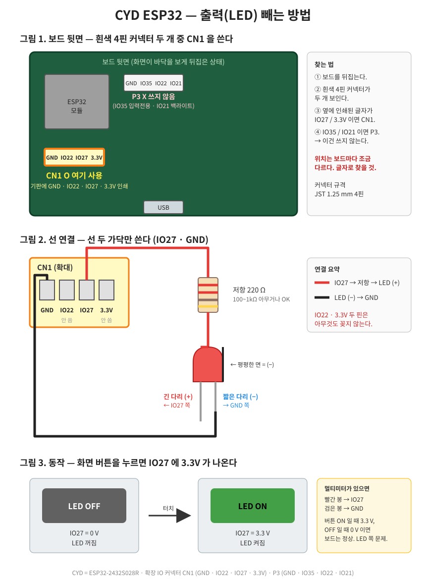

# CYD ESP32 — 출력(LED) 빼는 방법

화면 버튼을 누르면 **IO27** 핀에 3.3V 가 나온다. 이 핀에 LED 를 달면 된다.

## 준비물

| 항목 | 비고 |
|---|---|
| JST 1.25mm 4핀 케이블 | 보드에 딸려 온 흰색 커넥터 케이블 |
| LED 1개 | 색 상관없음 |
| 저항 220Ω 1개 | 100Ω~1kΩ 아무거나 됨 |

## 순서

1. 보드를 뒤집어 흰색 4핀 커넥터 두 개를 찾는다.
2. 옆에 **IO27 / 3.3V** 라고 인쇄된 쪽이 **CN1** 이다. 여기에 케이블을 꽂는다.
   - **IO35 / IO21** 이라고 인쇄된 쪽은 **P3**. 쓰지 않는다.
3. 케이블 4가닥 중 **IO27 자리 선**과 **GND 자리 선** 두 가닥만 쓴다.
   - 선 색은 제품마다 다르다. 커넥터에 꽂힌 **위치**로 판단한다.
4. IO27 선 → 저항 → LED **긴 다리(+)**
5. LED **짧은 다리(−)** → GND 선
6. 화면 버튼을 누른다. 초록색 "LED ON" 이 되면 LED 가 켜져야 한다.

## 안 될 때 확인

| 증상 | 확인할 것 |
|---|---|
| 화면은 ON/OFF 바뀌는데 LED 안 켜짐 | ① LED 방향 반대 → 다리 바꿔 꽂기 ② GND 선이 빠짐 ③ P3 에 꽂음 → CN1 으로 옮기기 |
| 항상 켜져 있음 | 3.3V 핀에 꽂음 → IO27 자리로 옮기기 |
| 화면 버튼 자체가 안 바뀜 | 펌웨어 문제. 알려 주면 확인 |
| 멀티미터 있으면 | IO27–GND 사이 전압. 버튼 ON = 3.3V, OFF = 0V 면 보드 정상 |

## 핀 정리

| 커넥터 | 핀 순서 | 사용 |
|---|---|---|
| **CN1** | GND · IO22 · IO27 · 3.3V | **IO27 + GND 사용** |
| P3 | GND · IO35 · IO22 · IO21 | 안 씀 (IO35 입력전용, IO21 백라이트) |
